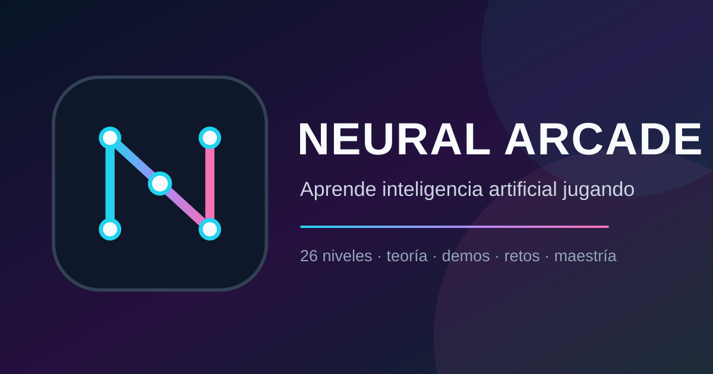

# Neural Arcade

Juego educativo web para aprender inteligencia artificial desde cero mediante **26 niveles interactivos**. Cada nivel recorre cinco fases: teoría, demo, práctica, reto y maestría.



## Qué incluye

- Ruta completa desde matemáticas y redes neuronales hasta LLM, RAG, agentes, MCP, seguridad y escalado.
- 26 demos o minijuegos completos, música ambiental procedural, efectos y preferencias guardadas localmente.
- 3 preguntas de práctica y al menos 5 preguntas de reto por nivel.
- Diseño responsive, selector de interfaz español/inglés, PWA instalable y soporte offline progresivo. El contenido pedagógico principal está en español.
- Metadatos sociales, datos estructurados, sitemap y robots listos para indexación.
- API de estado con rate limiting en memoria o distribuido mediante Upstash.
- Cabeceras de seguridad, Content Security Policy y recursos gráficos locales.

No hay cuentas ni base de datos: el progreso se conserva en `localStorage` del dispositivo.

## Requisitos

- Node.js 24.x.
- Bun 1.3.10 o una versión compatible.

## Desarrollo

```bash
bun install --frozen-lockfile
bun run dev
```

Abre <http://localhost:3000>.

## Calidad y producción

```bash
# Lint estricto, tipos, cobertura mínima del 80% y build de producción
bun run check

# Ejecutar el servidor construido
bun run start
```

La suite valida los 26 niveles, su orden, la integridad del contenido, los cuestionarios, los motores de juego, la persistencia, el rate limiter y los recursos de publicación. GitHub Actions ejecuta la misma comprobación en cada cambio; CodeQL y Dependabot vigilan el código y las dependencias.

Los navegadores bloquean audio automático sin interacción: la música comienza después del primer toque o tecla y puede desactivarse desde el control **Música**.

## Variables de entorno

Copia `.env.example` a `.env.local` cuando necesites configurar el entorno.

| Variable | Uso |
| --- | --- |
| `NEXT_PUBLIC_SITE_URL` | URL canónica pública. En Vercel puede omitirse porque se detecta la URL de producción. |
| `UPSTASH_REDIS_REST_URL` | Rate limiting distribuido opcional. |
| `UPSTASH_REDIS_REST_TOKEN` | Token REST de Upstash, opcional. |

Sin Upstash, la API usa un limiter en memoria acotado; es suficiente para desarrollo o una única instancia.

## Despliegue

Vercel es la opción recomendada:

1. Importa `ocazare2/Neural-Arcade` desde el panel de Vercel.
2. Conserva el preset Next.js y los comandos detectados desde `package.json`.
3. Configura `NEXT_PUBLIC_SITE_URL` si usarás dominio propio.
4. Opcionalmente configura las dos variables de Upstash.
5. Despliega y verifica `/`, `/api`, `/manifest.json`, `/robots.txt` y `/sitemap.xml`.

El procedimiento completo, incluido el alta en Google Search Console, está en [DEPLOYMENT.md](DEPLOYMENT.md).

## Estructura principal

```text
src/app/
├── api/route.ts                 # Estado y rate limiting
├── neural-arcade/
│   ├── NeuralArcade.tsx         # Aplicación principal
│   ├── curriculum.ts            # Orden canónico de 26 niveles
│   ├── data.ts                  # Currículo base
│   ├── extra-levels.ts          # Módulos avanzados
│   ├── math-primer.ts           # Fundamentos matemáticos
│   ├── quizzes.ts               # Banco principal
│   ├── supplemental-quizzes.ts  # Cobertura avanzada
│   └── components/              # UI, demos y fases
├── robots.ts
└── sitemap.ts
tests/                           # Pruebas Bun
public/                          # PWA, iconos y Open Graph
```

## Seguridad

No publiques archivos `.env*` ni tokens. Las vulnerabilidades se pueden reportar de forma privada siguiendo [SECURITY.md](SECURITY.md).

## Licencia

MIT. Creado por Ozkar K. Azares.

Proyecto hecho 100% con inteligencia artificial. El contenido y el software deben revisarse por una persona antes de reutilizarlos en contextos críticos.
